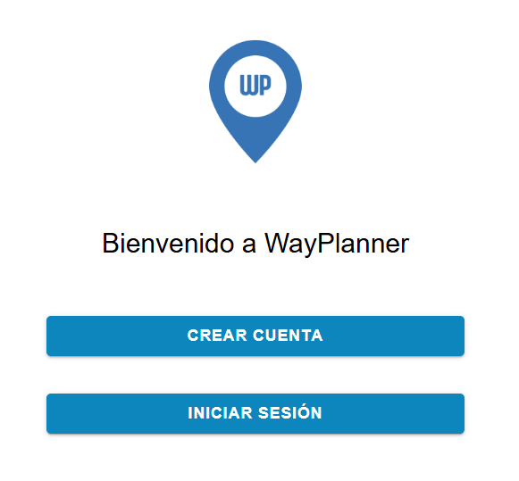

# Vistas de la Aplicación

## Pantalla de Inicio
- Muestra viajes activos y pasados
- Botón para crear nuevo viaje

## Vista de Viaje
- Organización general
- Acceso rápido a:
  - Itinerario
  - Rutas
  - Perfil
  - Configuración

## Vista de Itinerario
- Lista o calendario de actividades
- Edición de cada evento

## Vista de Billetes
- Agrupados por categoría
- Visualización de archivos PDF

## Vista de Maletas
- Gestión de artículos por maleta
- Filtros y orden

## Vista de Mapa
- Interacción con ubicaciones
- Cálculo de rutas

## Configuración y Notificaciones
- Preferencias del usuario
- Seguridad y alertas
